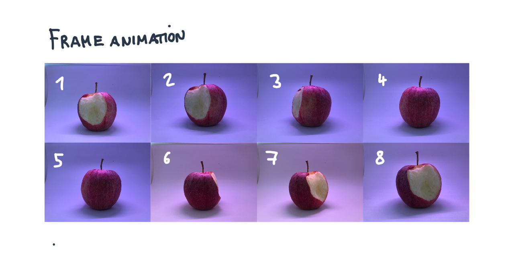
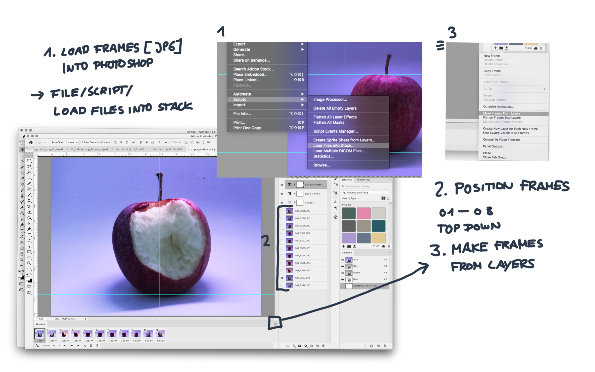
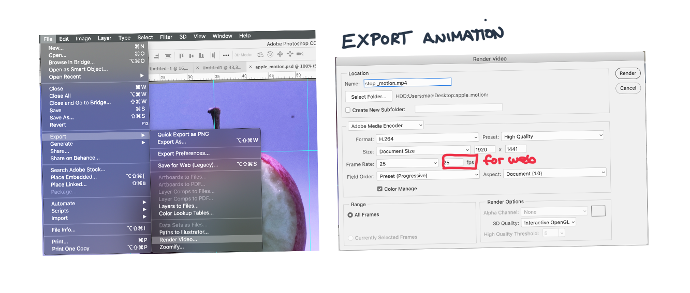

### Artivive Workshop
## How to do Stop-Motion

1. Build a Lightbox 

Use simple white carton and glue it to a cube togehter, take a small LED light and position it on the top of the Lightbox. 

2. Position object for each frame 

3. Add frames to Photoshop and edit frames

Important: Frames should have a counting number system, e.g. 01 to 08 (or the number of the last frame, in that case it is 08) 
3.1 Add the files with the Script LOAD FILES INTO STACK. then ypu collect all the files you want to add and load it into Photoshop
3.2 In the layer options you will see your files, check if they are in the right order: 01 should be on the top and 08 on the bottom of the layers. 
3.3 Now go to workspace Motion and click on the button 'create frame animation', then go to the burger menu and press 'make frames from layers' 

Now you should have your first animation ready. By clicking on the Play button you can test the animation. 
If you are happy with the result, go to export and render out animation.

